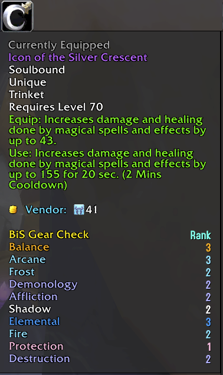
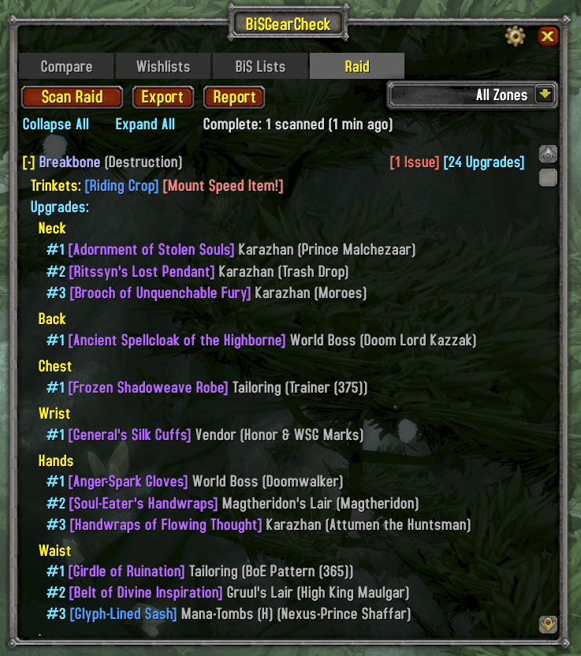
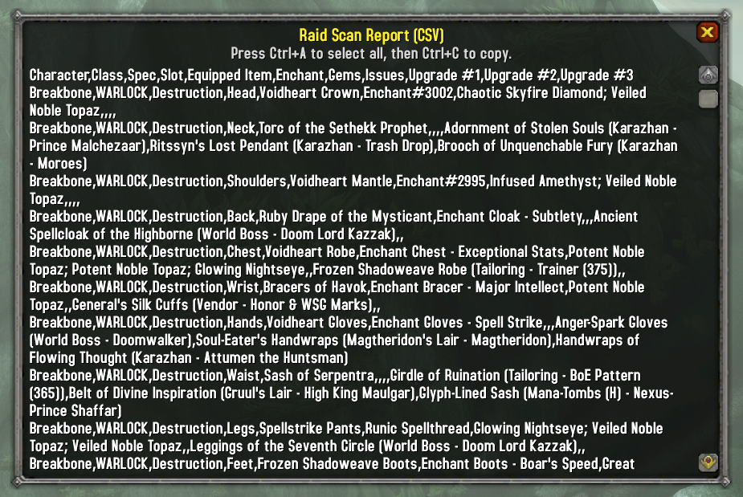
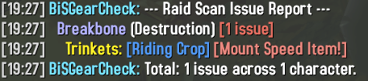
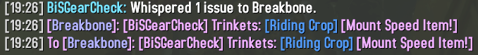

<p align="center">
  
</p>

<h1 align="center">BiS Gear Check</h1>

<p align="center">
  A World of Warcraft TBC Anniversary addon that compares your equipped gear against ranked Best in Slot lists.<br/>
  Tooltip integration, wishlists, full BiS list browsing, and multi-character support.
</p>

<p align="center">
  <strong>Author:</strong> Breakbone - Dreamscythe&nbsp;&nbsp;|&nbsp;&nbsp;<strong>Interface:</strong> 20505 (TBC Anniversary)
</p>

---

## Compare

See every upgrade available for your spec, ranked by slot. Your equipped item is shown with its BiS rank, and every item ranked higher is listed with its drop source.


- Auto-detects your spec from talent points
- Collapsible slot sections with Collapse All / Expand All
- Add upgrades directly to your wishlist with the **+** button
- Automatically refreshes when you swap gear
- Faction-aware: filters out items not available to your faction

## BiS Lists

Browse the full BiS list for any spec across all classes. Switch between data sources to compare rankings. Filter by zone to focus on a specific dungeon or raid.


- Class-colored headers in the spec dropdown
- Six data sources: WowTBC.gg, BiS-Tooltip, AtlasLoot, WoWSims, ThatsMyBis, Wowhead
- Zone filter to narrow results to a specific instance

## Wishlists

Track the items you're chasing across dungeons and raids. Create multiple named wishlists and filter by zone.


- Multiple wishlists per character with create, rename, and delete
- Filter by dungeon or raid zone
- Auto-filter mode shows items for your current zone when you enter an instance
- Zones with wishlist items are highlighted green in the dropdown

## Tooltip Integration

BiS rankings appear directly in item tooltips, grouped by data source. Hover over any item to see which specs rank it and at what position, with class-colored spec names.



- Works in bags, chat links, vendor windows, and the auction house
- Entries grouped by source with labeled headers (e.g., "BiSGearCheck (AtlasLoot)")
- Filter to your class only, or disable entirely
- Each source can be independently enabled/disabled for tooltips in Settings
- Detects conflicts with AtlasBIS Tooltips and lets you choose which to use

## Multi-Character Support

Switch between all characters on your account from the character selector dropdown. View another character's gear on the Compare tab, edit their wishlists, and plan upgrades across your roster. Gear snapshots are saved automatically. Set a minimum level threshold or ignore specific characters to keep the dropdown clean.

## Raid Scan

Inspect your entire raid at once. Scan all members to check for missing enchants, wrong gems, empty sockets, and mount-speed items left equipped. Each issue row shows the item's BiS list position so you can see at a glance how close someone's gear is to optimal.



- Scans all raid members in range via inspect
- Shows enchant, gem, and gear issues per character with BiS rank
- Upgrade suggestions per slot using the active data source
- Right-click a character to whisper their issues directly
- Export results as CSV or print a text report to chat
- Zone filter to focus upgrades on a specific instance
- Collapse/expand individual characters or all at once





## Settings

Configure tooltip display, enable or disable individual data sources for the addon UI and tooltips, and manage character filters.


- Toggle BiS tooltip injection and class-only filtering
- Per-source enable/disable for addon UI and tooltips
- Minimum character level threshold for the multi-character dropdown
- Character ignore list

## Usage

| Action | How |
|--------|-----|
| Open Compare | Left-click minimap button, or `/bisgear` |
| Open Wishlists | Right-click minimap button, or `/bgc wl` |
| Open Settings | Alt-click minimap button |

## Data Sources

| Source | Database | Description |
|--------|----------|-------------|
| WowTBC.gg | `Data.lua` | BiS rankings sourced from wowtbc.gg |
| BiS-Tooltip | `Data_Phase1.lua` | BiS rankings from BiS-Tooltip (boegi1) + WoWSims presets |
| AtlasLoot | `Data_AtlasLoot.lua` | BiS rankings from AtlasLoot data |
| WoWSims | `Data_WoWSims.lua` | Simulation-derived BiS from WoWSims TBC |
| ThatsMyBis | `Data_TMB.lua` | Community wishlist aggregates from thatsmybis.com |
| Wowhead | `Data_Wowhead.lua` | BiS rankings from Wowhead editorial guides |

Each source can be independently enabled for the addon UI and/or tooltips in Settings. Item drop sources (boss names, zones, quest names) are stored in `SourceDB.lua` covering 2,200+ items. Items can be tagged with a `faction` field ("Alliance" or "Horde") for faction-specific filtering; untagged items are available to both factions.

## Dependencies

No hard addon dependencies. The following libraries are bundled:

- LibStub
- CallbackHandler-1.0
- LibDataBroker-1.1
- LibDBIcon-1.0

## Limitations

- This addon is built for and tested on the **WoW TBC Anniversary** client only. BiS data sets are specific to this version.
- All UI text and data is in **English only**. Support for other languages may come in the future.
- Spec detection is based on talent points and may guess wrong for hybrid specs or characters that haven't spent talent points.

## Installation

Copy the `BiSGearCheck` folder into your WoW AddOns directory:

```
World of Warcraft/_anniversary_/Interface/AddOns/BiSGearCheck/
```
