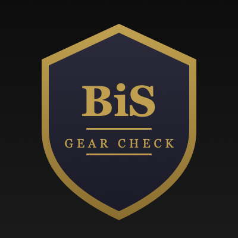
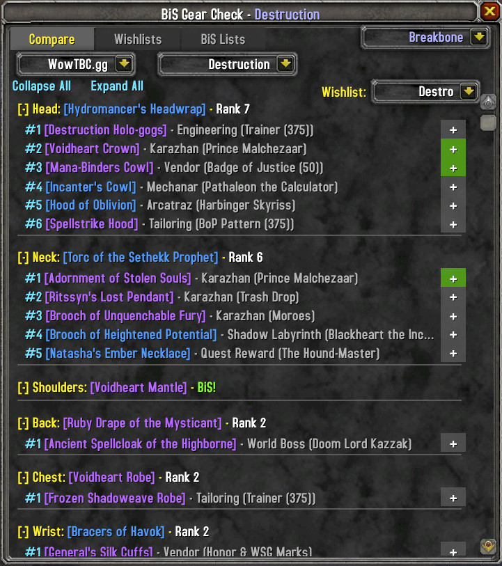
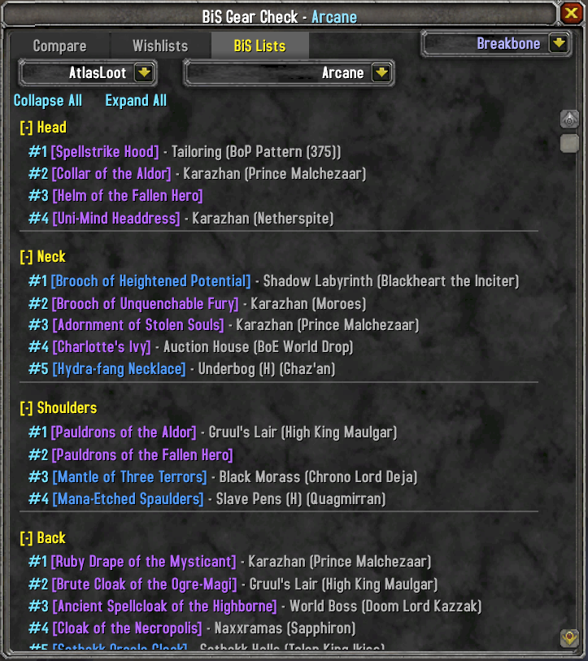
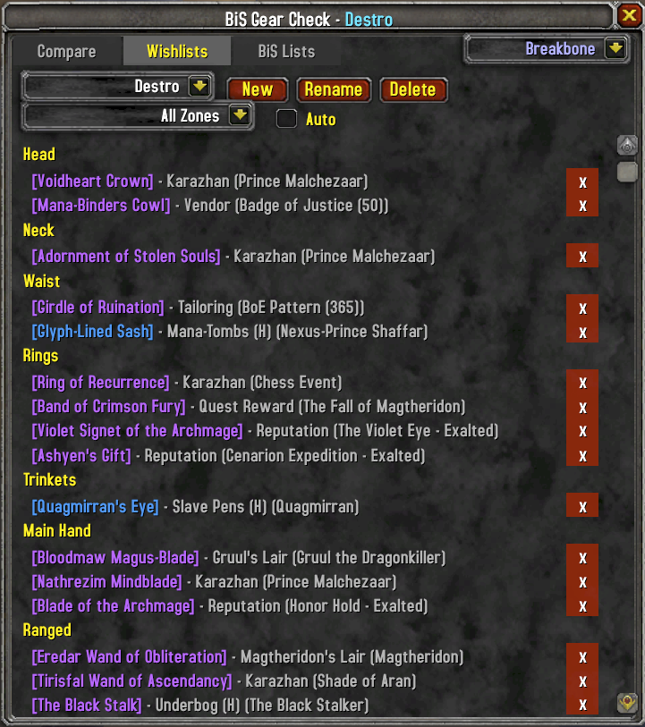
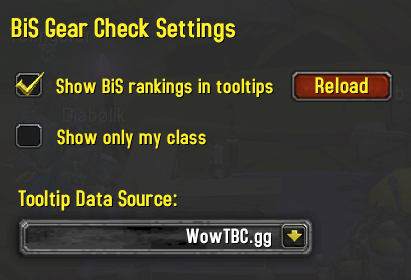

<p align="center">
  
</p>

<h1 align="center">BiS Gear Check</h1>

<p align="center">
  A World of Warcraft TBC Anniversary addon that compares your equipped gear against ranked Best in Slot lists.<br/>
  Tooltip integration, wishlists, full BiS list browsing, and multi-character support.
</p>

<p align="center">
  <strong>Author:</strong> Breakbone - Dreamscythe&nbsp;&nbsp;|&nbsp;&nbsp;<strong>Interface:</strong> 20505 (TBC Anniversary)
</p>

---

## Compare

See every upgrade available for your spec, ranked by slot. Your equipped item is shown with its BiS rank, and every item ranked higher is listed with its drop source.



- Auto-detects your spec from talent points
- Collapsible slot sections with Collapse All / Expand All
- Add upgrades directly to your wishlist with the **+** button
- Automatically refreshes when you swap gear
- Faction-aware: filters out items not available to your faction

## BiS Lists

Browse the full BiS list for any spec across all classes. Switch between data sources to compare rankings.



- Class-colored headers in the spec dropdown
- WowTBC.gg and AtlasLoot data sources

## Wishlists

Track the items you're chasing across dungeons and raids. Create multiple named wishlists and filter by zone.



- Multiple wishlists per character with create, rename, and delete
- Filter by dungeon or raid zone
- Auto-filter mode shows items for your current zone when you enter an instance
- Zones with wishlist items are highlighted green in the dropdown

## Tooltip Integration

BiS rankings appear directly in item tooltips. Hover over any item to see which specs rank it.



- Works in bags, chat links, vendor windows, and the auction house
- Filter to your class only, choose your data source, or disable entirely
- Detects conflicts with AtlasBIS Tooltips and lets you choose which to use

## Multi-Character Support

Switch between all characters on your account from the character selector dropdown. View another character's gear on the Compare tab, edit their wishlists, and plan upgrades across your roster. Gear snapshots are saved automatically.

## Usage

| Action | How |
|--------|-----|
| Open Compare | Left-click minimap button, or `/bisgear` |
| Open Wishlists | Right-click minimap button, or `/bgc wl` |
| Open Settings | Alt-click minimap button |

## Data Sources

| Source | Database | Description |
|--------|----------|-------------|
| WowTBC.gg | `Data.lua` (`BiSGearCheckDB`) | BiS rankings sourced from wowtbc.gg |
| AtlasLoot | `Data_AtlasLoot.lua` (`BiSGearCheckDB_AtlasLoot`) | BiS rankings from AtlasLoot data |

Item drop sources (boss names, zones, quest names) are stored in `SourceDB.lua`. Items can be tagged with a `faction` field ("Alliance" or "Horde") for faction-specific filtering; untagged items are available to both factions.

## Dependencies

No hard addon dependencies. The following libraries are bundled:

- LibStub
- CallbackHandler-1.0
- LibDataBroker-1.1
- LibDBIcon-1.0

## Limitations

- This addon is built for and tested on the **WoW TBC Anniversary** client only. BiS data sets are specific to this version.
- All UI text and data is in **English only**. Support for other languages may come in the future.
- Spec detection is based on talent points and may guess wrong for hybrid specs or characters that haven't spent talent points.

## Installation

Copy the `BiSGearCheck` folder into your WoW AddOns directory:

```
World of Warcraft/_anniversary_/Interface/AddOns/BiSGearCheck/
```
